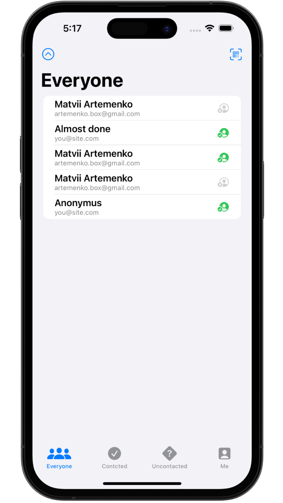
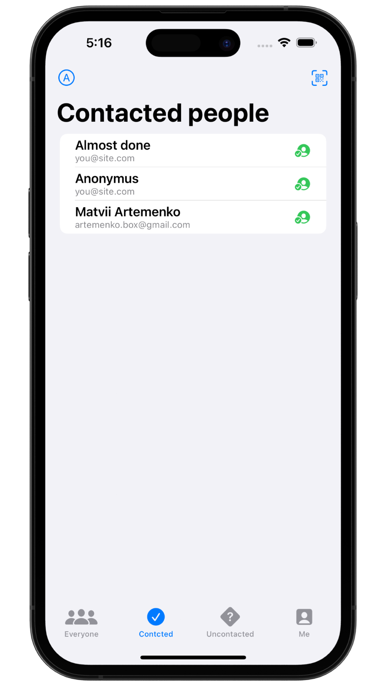

# &nbsp; 💭 Hot Prospects 

### Project 16
##### Author: *[MatviiArtemenko](https://github.com/100DaysOfSwiftUI-MatviiArtemenko)*

##### 100DaysOfSwiftUI form *[@twostraws](https://twitter.com/twostraws "twostraws twitter page")*

##### Follow along: *[100DaysOfSwiftUI](https://www.hackingwithswift.com/100/swiftui "Hacking with Swift")*

---

> *This was our largest project yet, but the end result is another really useful app that could easily form the starting point for a real conference. Along the way we also learned about custom environment objects, `TabView`, `Result`, `objectWillChange`, image interpolation, context menus, local notifications, Swift package dependencies, `filter()` and `map()`, and so much more – it’s been packed! We’ve explored several of Apple’s other frameworks now – `Core ML`, `MapKit`, `Core Image`, and now `UserNotifications`*

---

## &nbsp; 📚 Covered topics

Core Image, UserNotifications, FileManager

---
## &nbsp; 🎖 Challenge
* [x] Add an icon to the “Everyone” screen showing whether a prospect was contacted or not.

* [x] Use JSON and the documents directory for saving and loading our user data.

* [x] Use a confirmation dialog to customize the way users are sorted in each tab – by name or by most recent.

 

---
## &nbsp; 📲 Screenshoot

  
  
  

---
##  &nbsp; 🔍 &nbsp; Resources 

* [Apple documentation - UserNotifications](https://developer.apple.com/documentation/usernotifications/)
